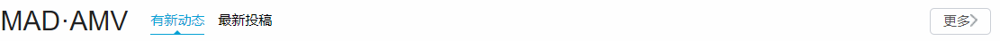
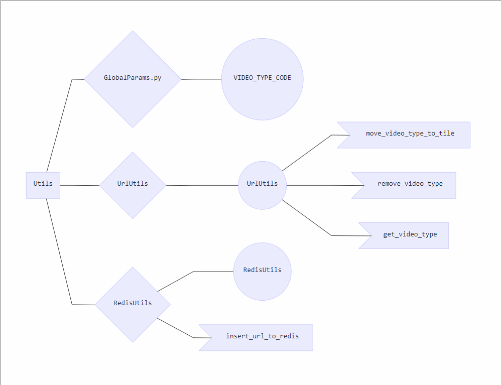

# BigDataTraining

## Spyder

This branch is for spider which retrive data from www.bilibili.com. Please put your code and brief description of your code here if your job is implement the spider or part of it.

### Packages

#### 1. bilibili_spyder

​	This package contains a spider which crawls URLs pointing to the list of each video categories.

These URLs are stored behand these navigate buttons.

##### API

This spider will write result to a CSV file called `nav_btn_item.csv`, 

CSV record Format:

| Button title | URL                      |
| ------------ | ------------------------ |
| 首页         | www.bilibili.com/?type=1 |

and it also write records to Redis database.

The Redis key is: <u>bilibili:class_urls</u>

The video type code is appended at the tail of each URL string. The type codes are defined in file 	`GlobalParams.py`

#### 2. link_more_spyder

​	This package contains a spider which crawls URLs linked to video list pages

These URLs are stored behand these buttons called “更多”.

##### API

This spider write URLs to Redis database for other spiders to use.

Record format: $Real\ URL + type\ code$, type code is defined in file `GlobalParams.py`

#### 3. Utils

Project structure:

##### API

UrlUtils: 

- Add video type code to URL
- Remove video type code from URL
- Get video typed code from URL

RedisUtils:

- Create a new Redis key and insert URLs to it
- 